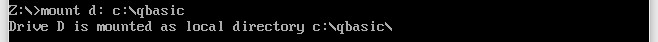

# First programs I've written on PC

I was about 10 years old when I discovered programming with my Sinclair ZX81. A few years later I discovered Omikron Basic on my Atari 520 STE and QBASIC on my syster's PC.

Recently I was cleaning hard drives on my good old PC and found a backup of programs I've written almost 30 years ago. It makes me feel a little bit nostalgic so I decided to share them on Github. Most of them are little games.

## Pre-requisites

You'll need [DOSBox](https://www.dosbox.com/) in order to run QB.EXE.

Clone this repo or copy it in a local folder, let say "c:\qbasic".

Start DOSBox and mount a drive pointing to your local folder :

```batch
Z:\>mount d: c:\qbasic
```



Then change drive to "d:" and run "QB.EXE" :

```batch
Z:\>d:
D:\>QB.EXE
```

Now you can load any .BAS file using the File menu. You can access it with keyboard or mouse.

> Most of these games are controlled using arrows on the numerical pad. 4 = LEFT, 6 = RIGHT, 5 = DOWN, 8 = UP.

## List of files (Alphabetically)

### A.BAS

A subroutine to ask user for its name and record its score.

