# First programs I've written on PC

I was about 10 years old when I discovered programming with my Sinclair ZX81. A few years later I discovered Omikron Basic on my Atari 520 STE and QBASIC on my syster's PC.

Recently I was cleaning hard drives on my plain old computer and found a backup of programs I've written almost 30 years ago. It makes me feel a little bit nostalgic so I decided to share them on Github. Most of them are little games.

## Pre-requisites

You'll need [DOSBox](https://www.dosbox.com/) in order to run QB.EXE.

Clone this repo or copy it in a local folder, let say "c:\qbasic".

Start DOSBox and mount a drive pointing to your local folder :

```batch
Z:\>mount d: c:\qbasic
```


Then change drive to "d:" and run "QB.EXE" :

```batch
Z:\>d:
D:\>QB.EXE
```

Now you can load any .BAS file using the File menu. You can access it with keyboard or mouse.

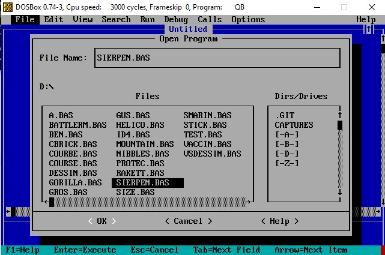

Select a file and run it using the "Run" menu.

> Most of these programs are games controlled using arrows on the numerical pad. 4 = LEFT, 6 = RIGHT, 5 = DOWN, 8 = UP. Press "ESC" to quit.

## List of files (Alphabetically)

### *.SPR

Sprite files. It is a proprietary format I've invented to easily store and retrieve sprites used in games.

### A.BAS

A subroutine to ask user for its name and record its score.

### BATTLERM.BAS

A game inspired from the famous "Battleship" game ("Touché coulé" in french).

First select the number of soldiers you want to play with. Then place your nuclear bomb and soldiers using the numerical pad and space bar. When asked for weapon, type "1" for simple attack and "2" for nuclear bomb (you can use it until it is destroyed by the ennemy). Then type the coordinates of the point you want to strike, for example "I15" and press ENTER. Repeat until you destroy every ennemy's soldier or you loose all of yours.

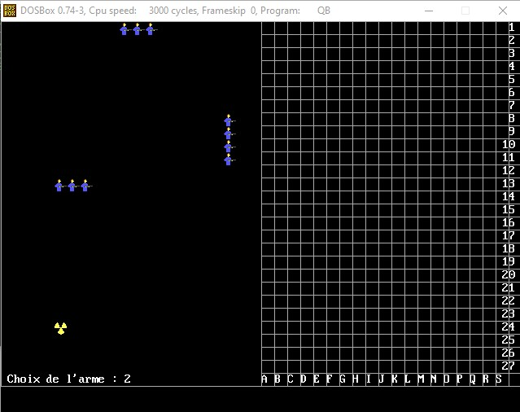

### CBRICK.BAS

A simple breakout.

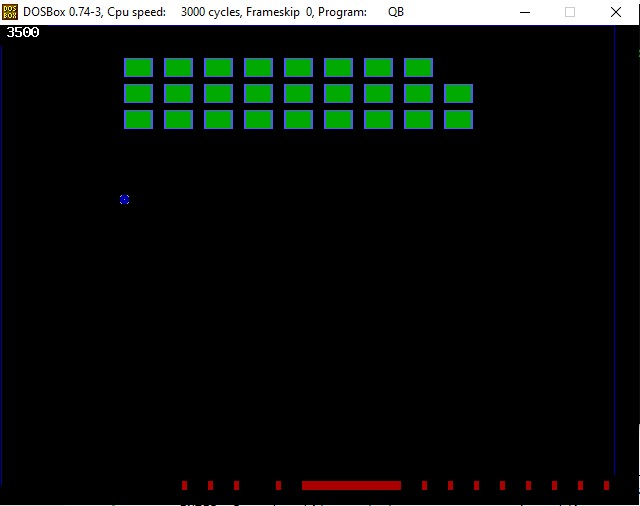

### COURBE.BAS

This program plots some functions.

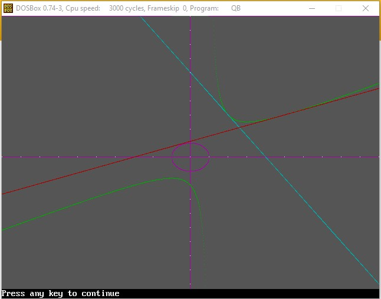

### COURSE.BAS

A horse race simulation. Will you guess which one will win ?

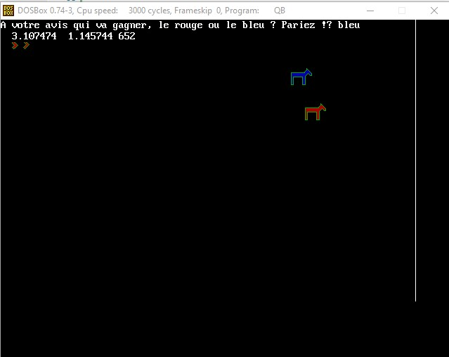

### DESSIN.BAS

I made this program in order to have a tool to draw, save and load sprites. I can't believe that I've drawn every sprites in my games using it!

Move the cursor using the numerical pad : 4 = LEFT, 6 = RIGHT, 8 = UP, 5 = DOWN, 7 = LEFT-UP DIAGONAL, 9 = RIGHT-UP DIAGONAL, ETC.

By default the color is black so it won't trace anything visible. You can change it using the "c" key. Type the color name when prompted, "rouge" for example.

To draw a circle press "0" and type the desired radius when prompted.

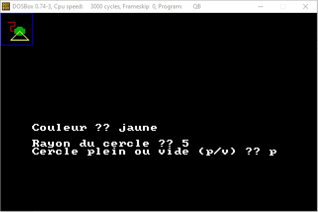

### GROS.BAS

A fat guy walking when we press 4 or 6 key. It is an abandonned platform game project.

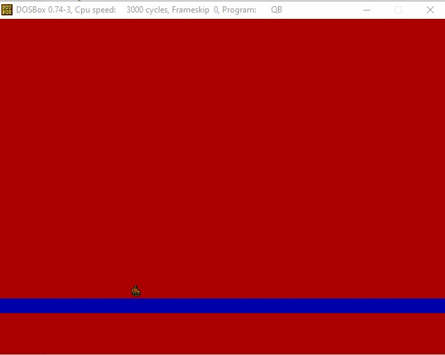

### GUS.BAS

My first attempt to animate a sprite. So ugly :)

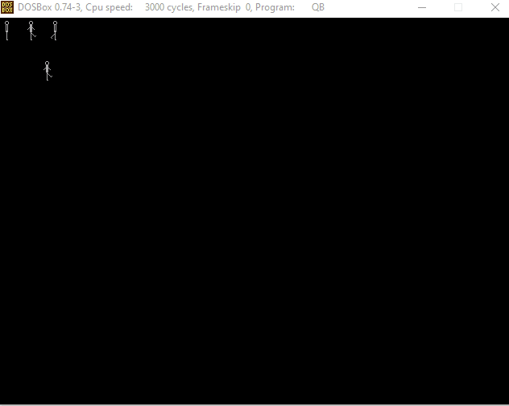

### HELICO.BAS

In this game you control an helicopter and you have to shoot ennemies before they shoot you. You have to move from bottom to top to advance to the next screen.

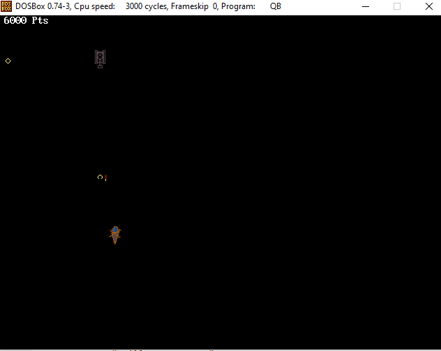

### ID4.BAS

This game was inspired by the movie "Independance Day". Unfortunately it is really far from it :) 

If you want to test it, you'll have to plug a joystick first. This game cannot be controlled with the keyboard. First launch STICK.BAS in order to calibrate your joystick. The calibration data will be saved in the file JOYSTICK.DAT.

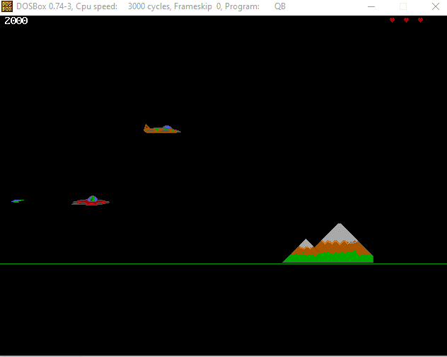

### MOUNTAIN.BAS

An attempt to randomly draw an mountain.

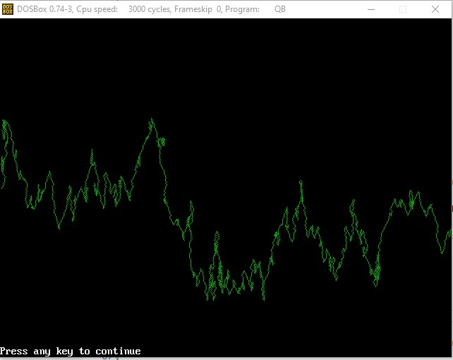

### NIBBLES.BAS

The famous nibbles game from Microsoft. I don't remember where I found this source code.

### RAKETT.BAS

A pong-like game.

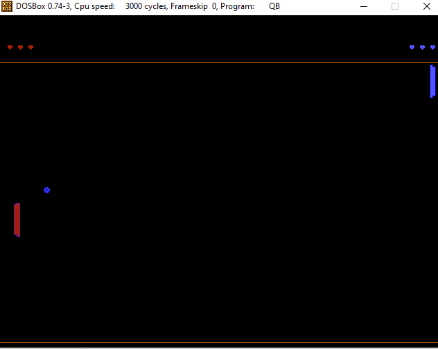

### SIERPEN.BAS

This program, written by a friend of mine, draws a Sierpinski triangle.

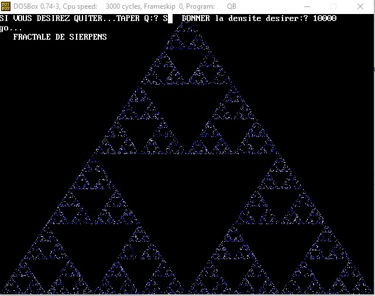

### SIZE.BAS

A tool to compute sprite size depending on screen mode.

### SMARIN.BAS

I found this code in a programmation magazine and I adapted it to QBasic.

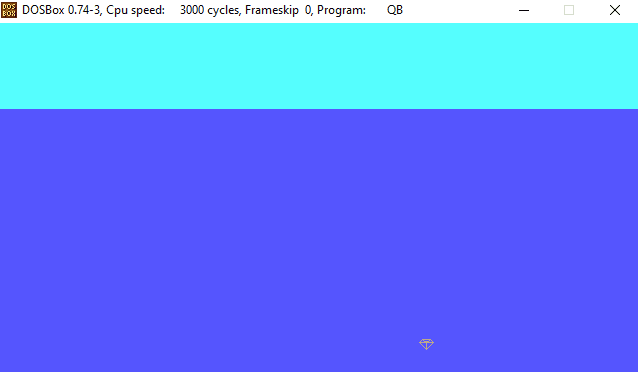

### STICK.BAS

A tool I have written to calibrate the joystick.

### TEST.BAS

A little test. The purpose was to simulate a ship journeying at high speed in a star field.

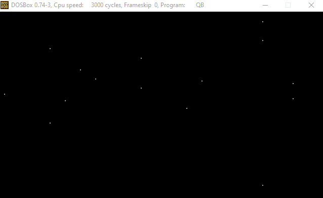

### VACCIN.BAS

A joke I made with a friend. This code simulate a defective antivirus which erase the hard drive. We installed it on the computer of a friend and modified his "autoexec.bat" in order to execute it automatically at startup. MS-DOS time ^^

